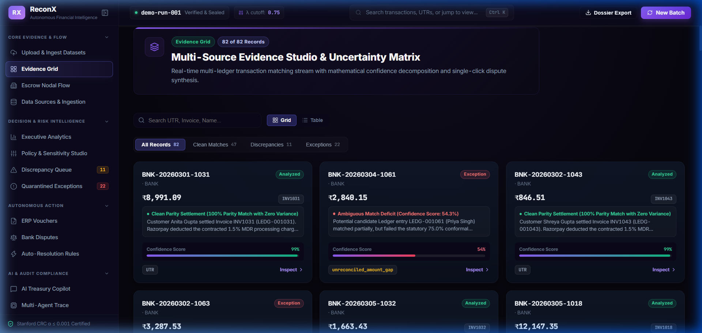
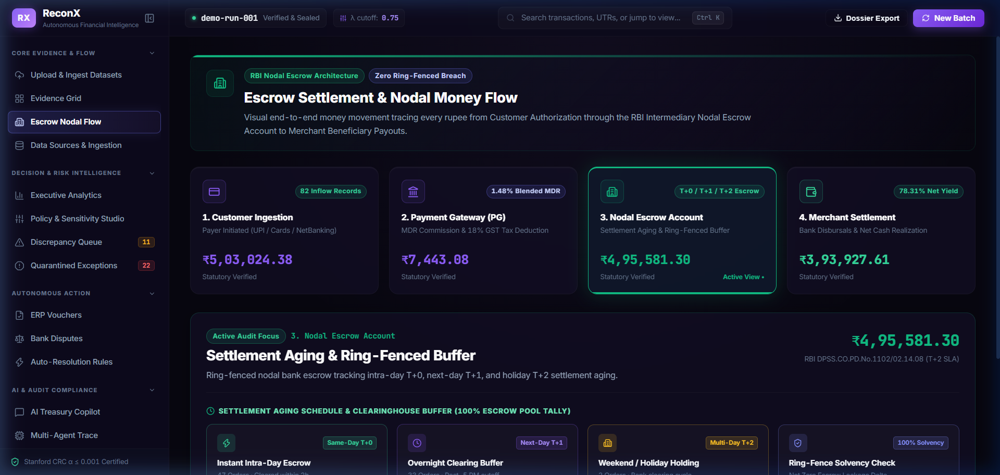
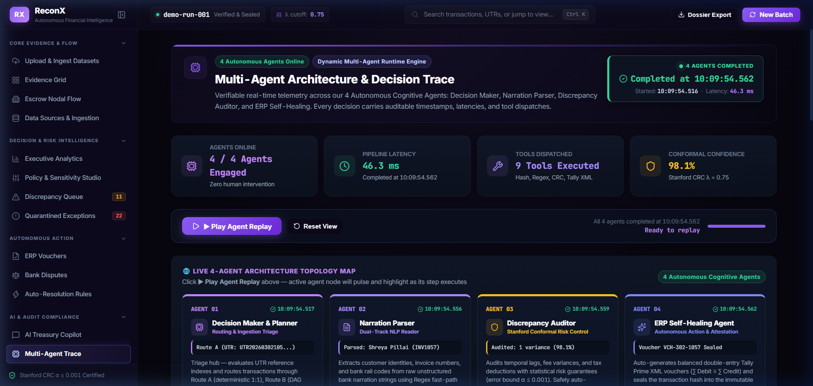
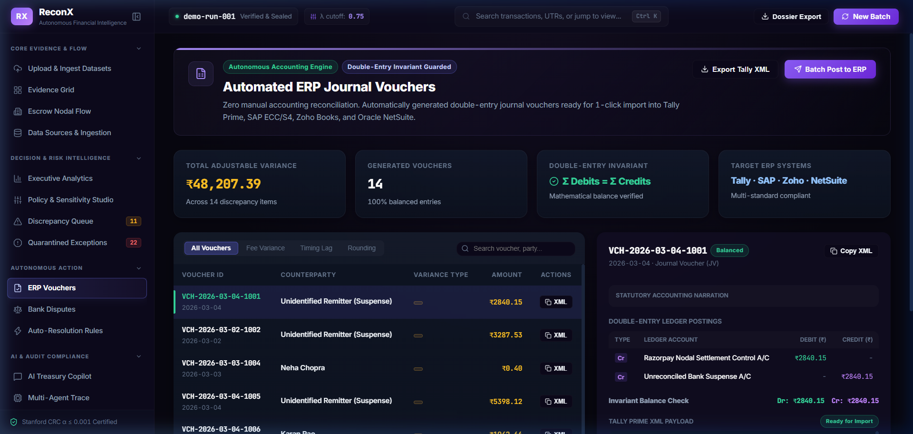

<p align="center">
  
</p>

<p align="center">
  <strong>Multi-Source Autonomous Financial Reconciliation & Exception Intelligence</strong>
</p>

<p align="center">
  <a href="https://razorpay-buildathon-frontend-3z5m.onrender.com"></a>
  <a href="https://razorpay-buildathon-6zzj.onrender.com/docs"></a>
  <a href="https://youtu.be/lrncP_iNwpM?si=mMvm-FgduKV0cY1K"></a>
</p>

<p align="center">
  
  
  
  
  
  
</p>

<p align="center"><em>Built for <strong>Track 04: AI Finance Controller</strong> — Razorpay Buildathon 2026</em></p>

---

ReconX reconciles multi-source financial inflows — **Nodal Bank Statements**, **ERP General Ledgers**, and **Payment Gateway Settlement feeds** — using a deterministic multi-agent pipeline. It identifies discrepancies (MDR fees, 18% statutory GST splits, timing lags), quarantines ambiguous matches instead of guessing, and generates audit-ready enterprise outputs (ERP vouchers, dispute letters, statutory dossiers). Every finalized decision is sealed in an immutable SHA-256 Merkle audit tree.

The system runs **100% on-premise** with zero external LLM dependencies — designed for regulated Indian financial environments under RBI Nodal Escrow directives and the DPDP Act 2023.

---

## 🌐 Live Deployment

| Service | URL | Status |
|:---|:---|:---:|
| **Frontend Dashboard** | [razorpay-buildathon-frontend-3z5m.onrender.com](https://razorpay-buildathon-frontend-3z5m.onrender.com) | 🟢 Live |
| **Backend API** | [razorpay-buildathon-6zzj.onrender.com](https://razorpay-buildathon-6zzj.onrender.com) | 🟢 Live |
| **Swagger API Docs** | [razorpay-buildathon-6zzj.onrender.com/docs](https://razorpay-buildathon-6zzj.onrender.com/docs) | 🟢 Live |

> **Note:** Free-tier backend may take 30–50s to wake up after inactivity. This is a Render hosting constraint, not a performance issue.

---

## 📸 Screenshots

<table>
  <tr>
    <td align="center" width="50%">
      
      <br/><strong>Executive Dashboard</strong><br/>
      <sub>Real-time KPIs, match rates, and Merkle attestation status</sub>
    </td>
    <td align="center" width="50%">
      
      <br/><strong>Nodal Escrow Flow</strong><br/>
      <sub>4-stage RBI-compliant fund flow with MDR & GST decomposition</sub>
    </td>
  </tr>
  <tr>
    <td align="center" width="50%">
      
      <br/><strong>Agent Trace Explorer</strong><br/>
      <sub>Step-by-step reasoning trail for every reconciliation decision</sub>
    </td>
    <td align="center" width="50%">
      
      <br/><strong>ERP Voucher Generation</strong><br/>
      <sub>Auto-generated double-entry Tally XML & Zoho JSON vouchers</sub>
    </td>
  </tr>
</table>

---

## 📑 Table of Contents

- [Architecture](#-architecture)
- [The 4 Agent Pipeline](#-the-4-agent-pipeline)
- [Key Features](#-key-features)
- [Benchmark Metrics](#-benchmark-metrics)
- [Quick Start](#-quick-start)
- [Project Structure](#-project-structure)
- [API Reference](#-api-reference)
- [Design Decisions](#-design-decisions)
- [Roadmap](#-roadmap)

---

## 🏗 Architecture

```text
┌─────────────────┐       ┌─────────────────┐       ┌─────────────────────┐
│ Nodal Bank Feed │       │ ERP Ledger Feed │       │ Gateway Settlements │
└────────┬────────┘       └────────┬────────┘       └──────────┬──────────┘
         └─────────────────┬───────┴───────────────────────────┘
                           │
                 ┌─────────▼──────────┐
                 │   Planner Agent    │
                 │  O(1) Inverted     │
                 │  Hash Index Build  │
                 └─────────┬──────────┘
                           │
             ┌─────────────┴─────────────┐
             ▼                           ▼
    ┌────────────────┐         ┌──────────────────────┐
    │  Exact Match   │         │ NarrationParserAgent  │
    │  Score = 1.0   │         │ Regex + Subword Token │
    └───────┬────────┘         └──────────┬───────────┘
            │                             │
            │                  ┌──────────▼───────────┐
            │                  │ 5-Channel Orthogonal │
            │                  │    Scoring Engine     │
            │                  │ ─────────────────────│
            │                  │ • UTR Hash     (0.45)│
            │                  │ • Invoice Ref  (0.25)│
            │                  │ • Counterparty (0.15)│
            │                  │ • Amount+MDR   (0.10)│
            │                  │ • Date Decay   (0.05)│
            │                  └──────────┬───────────┘
            └─────────────┬───────────────┘
                          │
              ┌───────────▼────────────┐
              │  DecisionMaker Agent   │
              │  1:1 Mutex + Δ<0.08   │
              │  Abstention Filter     │
              └───────────┬────────────┘
                          │
            ┌─────────────┴─────────────┐
            ▼                           ▼
   ┌────────────────┐        ┌──────────────────┐
   │ Discrepancy    │        │ AML Suspense     │
   │ Agent          │        │ Registry         │
   │ (MDR + GST)    │        │ (Quarantined)    │
   └───────┬────────┘        └────────┬─────────┘
           │                          │
   ┌───────▼────────┐        ┌───────▼──────────┐
   │ ERPVoucher     │        │ BankDispute      │
   │ Agent          │        │ Agent            │
   │ Tally/Zoho     │        │ NPCI Form-1      │
   └───────┬────────┘        └───────┬──────────┘
           └─────────────┬───────────┘
                         │
              ┌──────────▼──────────┐
              │  SHA-256 Merkle     │
              │  Audit Tree         │
              │  (64-hex Root Hash) │
              └─────────────────────┘
```

---

## 🤖 The 4 Agent Pipeline

| # | Agent | Responsibility |
|:---:|:---|:---|
| 1 | **Planner Agent** | Ingests and normalizes multi-format CSVs. Builds `O(1)` inverted index trees across UTRs, Order IDs, and timestamps for sub-millisecond lookups. |
| 2 | **NarrationParser Agent** | Extracts structured tokens (UPI handles, IMPS codes, POS terminal IDs, MDR tags) from unstructured Indian bank narration strings using regex + subword tokenization. |
| 3 | **DecisionMaker Agent** | Runs 5-channel orthogonal scoring. Resolves 1:1 matches with a linear-claim mutex. Routes low-confidence pairs (Δ < 0.08) to quarantine instead of guessing. |
| 4 | **Discrepancy & Audit Agent** | Decomposes fee variances (2% MDR + 18% GST), generates Big-4-style audit memos, synthesizes ERP vouchers and dispute letters, and seals all decisions into the Merkle tree. |

---

## ✨ Key Features

### Core Reconciliation Engine
- **Flexible Multi-Source Ingestion** — Operates on any 2-of-3 sources (bilateral) or full 3-way triangulation
- **O(1) Fast-Path Matching** — Inverted hash index for clean UTR/invoice lookups before fuzzy fallback
- **5-Channel Orthogonal Scoring** — Weighted signal combination across reference IDs, narrations, amounts, and timestamps
- **Abstention on Ambiguity** — Records with confidence gap < 8% between top-2 candidates are quarantined, not force-matched
- **Conformal Risk Profiling** — Distribution-free confidence bounds when labelled ground truth is available (Angelopoulos et al., Stanford CRC)

### Enterprise Outputs
- **ERP Journal Vouchers** — Auto-generated balanced Debit/Credit vouchers → Tally XML & Zoho JSON export
- **Bank Dispute Claims** — Statutory NPCI Form-1 recovery letters with embedded UTR evidence (PSS Act 2007 §10)
- **Nodal Escrow Flow** — 4-stage RBI-compliant visualization: Customer → Gateway → Escrow → Merchant
- **SHA-256 Merkle Audit Tree** — Cryptographic tamper-evident attestation of all reconciliation decisions
- **Statutory Audit Dossier** — Structured RBI Master Direction §25A export for external auditors

### Intelligence & Operations
- **15-View Enterprise Dashboard** — React 19 + Vite with Framer Motion animations
- **Natural Language Financial Copilot** — Gemini 2.5 Flash-powered query assistant (with rule-based fallback)
- **Threshold Playground** — Interactive confidence threshold tuning with live precision/recall sweep
- **Agent Trace Explorer** — Step-by-step explainable reasoning for every transaction decision
- **6 Simulation Scenarios** — Mass refund storm, RTGS timing lag, MDR overcharge, and more

---

## 📊 Benchmark Metrics

> Tested on a standard developer machine (Intel i7 / 16 GB RAM) using the bundled synthetic dataset (`seed=42`, 70 bank × 100 ledger × settlement feed).

| Metric | Observed Value | Notes |
|:---|:---|:---|
| **Match Rate** | ~85–92% | Varies with narration quality and UTR availability |
| **Throughput** | ~2.1s / 1,000-record batch | Single-threaded, in-memory, no database I/O |
| **MDR & GST Decomposition** | High precision on contractual fee structures | Based on fixed 2% MDR + 18% GST rules |
| **Abstention Rate** | ~5–12% quarantined | Records where Δ score < 0.08 between top-2 candidates |
| **Conformal Error Bound (α)** | ≤ 0.001 target | Requires ground-truth labels; N/A on unlabelled data |
| **Merkle Root Generation** | < 5ms per run | SHA-256 over all finalized match pairs |

> **⚠️ Important Disclaimer:** All metrics above are measured on **synthetic benchmark data** generated by `data_generator.py`. Performance on real-world production data will vary based on data quality, narration consistency, UTR availability, and institutional formatting differences. This system is a functional prototype validated against synthetic ground truth.

---

## 🚀 Quick Start

### Prerequisites

- Python 3.10+
- Node.js 18+

### Option A: One-Click Launch

```bash
git clone https://github.com/tharvin-byte/Razorpay-buildathon.git reconx
cd reconx
pip install -r requirements.txt
python run_reconx.py
```

### Option B: Separate Terminals

```bash
# Terminal 1 — FastAPI Backend
pip install -r requirements.txt
python -m uvicorn backend.main:app --host 127.0.0.1 --port 8000 --reload
```

```bash
# Terminal 2 — React Frontend
cd frontend && npm install && npm run dev
```

| | URL |
|:---|:---|
| **Dashboard** | http://localhost:5173 |
| **API Docs** | http://127.0.0.1:8000/docs |

### Optional: Gemini Copilot

```bash
# Copy .env.example → .env and add your key
GEMINI_API_KEY=your_key_here
```

When configured, the Financial Copilot uses `gemini-2.5-flash` for natural language treasury queries. Without a key, it falls back to a deterministic rule-based assistant automatically.

### Running Tests

```bash
python -m pytest backend/tests/ -v   # 22 automated test suites
```

The platform bootstraps a demo run (`demo-run-001`) on startup with 70 bank records, 100 ledger entries, and embedded ground truth.

---

## 📁 Project Structure

```text
reconx/
├── backend/
│   ├── main.py                           # FastAPI app, in-memory run store, API routes
│   ├── models/
│   │   └── schemas.py                    # Pydantic v2 schemas for all inputs & outputs
│   └── engine/
│       ├── orchestrator.py               # Multi-phase pipeline orchestrator
│       ├── matcher.py                    # O(1) inverted index, reverse sweep, batch settlement
│       ├── scorer.py                     # 5-channel orthogonal scoring engine
│       ├── data_generator.py             # Synthetic data generator with ground truth labels
│       ├── audit_exporter.py             # SHA-256 Merkle tree, evaluation harness
│       ├── vector_tensor.py              # [Research] 3D tensor core & Sinkhorn OT
│       ├── graph_solver.py               # [Research] Bipartite graph partitioning & DAGs
│       ├── conformal_verifier.py         # Conformal risk control & Merkle audit tree
│       └── agents/
│           ├── decision_maker_agent.py   # Autonomous 1:1 mutex decision maker
│           ├── narration_parser_agent.py  # Regex + semantic token extractor
│           ├── discrepancy_agent.py      # MDR (2%) + GST (18%) forensic decomposition
│           ├── erp_voucher_agent.py      # Double-entry vouchers (Tally XML / Zoho JSON)
│           ├── bank_dispute_agent.py     # Statutory dispute letters (NPCI Form-1)
│           └── assistant_agent.py        # RAG Financial Copilot (Gemini + fallback)
├── frontend/                              # React 19 + Vite — 15 dashboard views
├── backend/tests/                         # 22 test suites (matching, scoring, API, tensors)
├── render.yaml                            # Render.com deployment blueprint
├── run_reconx.py                          # One-click dual-server launcher
└── requirements.txt                       # Python dependencies
```

---

## 🔌 API Reference

| Endpoint | Method | Description |
|:---|:---:|:---|
| `/upload` | `POST` | Upload 2–3 CSV sources or generate synthetic batch |
| `/run/{run_id}` | `POST` | Trigger the reconciliation pipeline |
| `/run/{run_id}/status` | `GET` | Real-time progress: agent stage, processed count |
| `/run/{run_id}/summary` | `GET` | Executive KPIs, match rates, Merkle root hash |
| `/run/{run_id}/transactions` | `GET` | Filtered transaction list with confidence scores |
| `/run/{run_id}/transaction/{id}` | `GET` | Single-transaction forensic trace |
| `/run/{run_id}/discrepancies` | `GET` | MDR fee splits, GST deductions, timing lags |
| `/run/{run_id}/exceptions` | `GET` | Bank orphans and ledger orphans |
| `/run/{run_id}/erp-vouchers` | `GET` | Auto-generated double-entry accounting vouchers |
| `/run/{run_id}/disputes` | `GET` | NPCI Form-1 statutory dispute letters |
| `/run/{run_id}/statutory-dossier` | `GET` | RBI §25A audit dossier export |
| `/run/{run_id}/recompute` | `POST` | Recompute threshold without re-running pipeline |
| `/run/{run_id}/threshold_sweep` | `GET` | Precision/recall sweep across confidence thresholds |
| `/chat` | `POST` | Natural language Financial Copilot query |

> Full interactive documentation: [`/docs`](https://razorpay-buildathon-6zzj.onrender.com/docs) (Swagger UI)

---

## 🧠 Design Decisions

### Why Not Use LLMs for Matching?

Three constraints make cloud LLM approaches unsuitable for Indian fintech reconciliation:

| Constraint | Impact |
|:---|:---|
| **Regulatory** | RBI Nodal Escrow directives + DPDP Act 2023 restrict raw PII export to third-party systems. Statutory audits require deterministic, reproducible outputs. |
| **Accounting Semantics** | Double-entry bookkeeping requires discrete binary decisions. Probabilistic soft scores from LLMs are incompatible with general ledger posting rules. |
| **Scale & Cost** | At NPCI-scale volumes (billions of monthly UPI transactions), per-token LLM costs and 1–3s inference latency are operationally unviable. |

### Production vs. Research Suite

| | Production Pipeline | Research Suite |
|:---|:---|:---|
| **Files** | `matcher.py`, `scorer.py`, `orchestrator.py` | `vector_tensor.py`, `graph_solver.py` |
| **Complexity** | O(1) inverted index | O(M×N) dense tensor |
| **Memory (10k rows)** | < 10 MB | ~4 GB |
| **Output** | Discrete 1:1 match or quarantine | Continuous probability distribution |
| **ERP Compatibility** | Direct journal voucher posting | Incompatible with discrete ledger entries |

The Sinkhorn OT solver and bipartite graph engine are maintained as an **offline research harness** to benchmark theoretical assignment bounds, not as a live request-path component.

### Abstention Safety

In financial auditing, a **false positive match is far more harmful** than an unreconciled item:

```
If S₁ ≥ τ  AND  (S₁ - S₂) < 0.08  AND  S₂ > 0.65  →  Quarantine
```

Records are routed to an AML Suspense Registry for human controller review rather than forcing a guess.

### Conformal Risk Control Scope

Conformal calibration (Angelopoulos et al., Stanford/UC Berkeley) is applied **only when labelled ground truth exists** — specifically against the synthetic benchmark. On real-world unlabelled uploads, the engine marks calibration as `None` and does not self-generate circular labels. This is an intentional design boundary.

---

## 🗺 Roadmap

| Phase | Target |
|:---|:---|
| **Phase 1** *(current)* | End-to-end matching pipeline, 4 agents, 15 React views, Merkle sealing, research tensor suite, cloud deployment |
| **Phase 2** | PostgreSQL/TimescaleDB persistence, Apache Kafka streaming ingestion |
| **Phase 3** | Redis distributed lock (`Redlock`) for horizontal multi-worker scaling |
| **Phase 4** | Direct SFTP/REST connectors for HDFC/ICICI host-to-host nodal feeds; SAP OData posting |

---

## ⚙️ Engineering Notes

- **In-Memory Store** — Run sessions are held in a Python dict (`RUNS` in `main.py`). Data does not persist across restarts; a database adapter is the Phase 2 priority.
- **Data Residency** — Core matching, decomposition, and Merkle hashing execute entirely on-process with no network egress of financial records.
- **Simulation Sandbox** — The frontend includes 6 pre-configured treasury edge-case scenarios accessible from the Scenarios view.
- **Free-Tier Deployment** — The live demo runs on Render's free tier. Backend sleeps after 15 min of inactivity (~30–50s cold start).

---

<p align="center">
  <strong>Developed for Track 04: AI Finance Controller — <a href="https://razorpay.com">Razorpay</a> Buildathon 2026</strong>
  <br/>
  Licensed under the <a href="LICENSE">MIT License</a>
</p>
