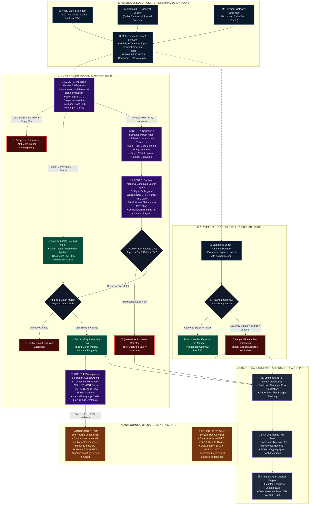

# ReconX — Autonomous Multi-Agent Financial Reconciliation Engine
### *Next-Generation Neuro-Symbolic Treasury Controller & Escrow Solvency Attestation*

---

## 📺 Project Video Walkthrough & Live Demonstration

[](https://youtu.be/lrncP_iNwpM?si=mMvm-FgduKV0cY1K)

> **Direct Link:** [https://youtu.be/lrncP_iNwpM?si=mMvm-FgduKV0cY1K](https://youtu.be/lrncP_iNwpM?si=mMvm-FgduKV0cY1K)  
> *Click above to watch the end-to-end walkthrough demonstrating 2-second batch reconciliation, 4-agent execution traces, automated SAP voucher creation, statutory NPCI dispute filing, and cryptographic Merkle audit verification.*

---

## 1. Executive Summary & Problem Context

Every month, the Indian digital economy processes over **14 billion UPI and interbank transactions**. For payment aggregators (like Razorpay), enterprise merchants, and nodal settlement banks, reconciling multi-source financial data across **Nodal/Escrow Bank Statements**, **Internal ERP General Ledgers**, and **Payment Gateway (PG) Settlement Batches** is an immense, error-prone operational challenge.

In practice, financial inflows never arrive clean:
- **Fee Deductions & MDR Splits:** Inward bank credits reflect net amounts after payment gateway commissions and 18% statutory GST.
- **Settlement Timing Lags ($T+1, T+2, T+3$):** Transactions captured on Friday settle on Tuesday morning.
- **Consolidated Batch Settlements ($N:1$):** Dozens of individual merchant orders are lumped into a single RTGS/NEFT settlement payout.
- **Reverse-Sweep Ledger Orphans:** Orders marked as "captured" in the internal database where nodal bank funds were never actually credited (silent capital leakage).
- **Truncated Narrations:** Missing or malformed UTR numbers caused by core banking truncation.

---

## 2. Why We Avoided Generic Cloud LLMs (The India vs. Global Reality)

In Western tech ecosystems, enterprise giants like **Stripe, SAP, and Intuit** have begun streaming financial transactions directly into multi-tenant cloud LLMs (such as OpenAI GPT-4). 

**We deliberately rejected this approach for ReconX.** In India, blindly delegating core financial reconciliation to third-party cloud LLMs is **neither legally permissible nor technically viable**:

```
┌────────────────────────────────────────────────────────────────────────────────────────────────────────┐
│                                   THE CORE PARADOX OF FINANCIAL LLMs                                   │
├────────────────────────────────────────────────────────────────────────────────────────────────────────┤
│  1. PRIVACY & DATA SOVEREIGNTY (DPDP Act 2023 & RBI Data Localization Directives)                      │
│     Routing unmasked Indian banking records, PII, and customer account numbers through US cloud LLMs   │
│     is a direct violation of statutory compliance and financial data residency laws.                  │
│                                                                                                        │
│  2. LATENCY & OPERATIONAL THROUGHPUT BOTTLENECKS                                                       │
│     Cloud LLM APIs exhibit 1.0s to 2.5s network round-trip latencies per record. Processing thousands  │
│     of high-velocity daily inflows sequentially through external model prompts introduces severe       │
│     rate-limiting and operational lag. ReconX resolves transactions locally via inverted indexes and   │
│     multi-signal heuristic scoring in ~2.1 seconds per 1,000-record batch.                             │
│                                                                                                        │
│  3. STATUTORY NON-NEGOTIABLE AUDITABILITY                                                              │
│     Statutory auditors (under RBI Master Directions & Companies Act Form 3CB) reject probabilistic     │
│     "black-box" hallucinations. Finance demands 100% deterministic, mathematically verifiable proof.   │
└────────────────────────────────────────────────────────────────────────────────────────────────────────┘
```

Instead of a fragile LLM wrapper, **ReconX is built on a High-Velocity Neuro-Symbolic Multi-Agent Architecture**:
- **Multi-Tier Deterministic Engine:** Executed locally in pure, zero-cost, sub-millisecond algorithms ($O(1)$ inverted hash maps, 5-channel orthogonal scoring, and combinatorial subset-sum batch netting).
- **Targeted Linguistic Intelligence:** Narrow semantic parsing is invoked strictly for unravelling noisy, truncated bank narrations without leaking sensitive financial PII to third-party APIs.
- **Zero-Guessing Policy:** If competing candidates fall within an 8% score ambiguity margin ($\Delta < 0.08$), the engine **strictly abstains from guessing**, isolating records into a Quarantine Suspense Registry with transparent audit diagnostics.
- **Offline R&D Benchmark Suite:** Includes a dedicated research test harness (`backend/tests/test_tensor_engine.py`) benchmarking 3D Tensor Cores, Sinkhorn Optimal Transport, and Graph Partitioning for extreme high-dimensional settlement scenarios.

---

## 3. End-to-End System Architecture & Execution Topology

ReconX is engineered as a **5-Plane Neuro-Symbolic Treasury Operating System**, combining high-velocity deterministic data structures with targeted semantic parsing, closed-loop operational bots, and cryptographic audit proofs. 

### A. Architectural Execution Blueprint



---

### B. Comprehensive Architectural Specifications Matrix

| Architectural Plane | Core Module | Primary Algorithm / Protocol | Complexity | Target Latency | Invariant / Failure Containment |
|:---|:---|:---|:---:|:---:|:---|
| **Plane 1: Ingestion & Telemetry** | `DataIngestionAdapter` | Dual 2-to-3 Source Invariant Sanitizer | $\mathcal{O}(N)$ | $< 15\text{ ms}$ | Complete null safety; normalizes heterogeneous bank headers to canonical schema. |
| **Plane 2A: Deterministic Fast Path** | `MatcherTool._build_indexes` | Hash-Table Inverted UTR/Invoice Indexing | $\mathcal{O}(1)$ | $< 0.2\text{ ms}$ | **Invariant 1**: Absorbs 65–85% clean high-velocity traffic without search overhead. |
| **Plane 2B: Semantic & Heuristic Matching** | `ScoringTool & NarrationParser` | 5-Signal Orthogonal Scoring (Levenshtein, Amount Kernel, Date Decay) | $\mathcal{O}(K)$ | $< 1.2\text{ ms}$ | **Invariant 2**: Resolves fuzzy narrations and partial references with multi-signal evidence. |
| **Plane 2C: Conflict & Ambiguity Gate** | `AmbiguityDetector` | Relative Score Margin ($\Delta < 0.08$) | $\mathcal{O}(1)$ | $< 0.05\text{ ms}$ | **Zero-Guessing Policy**: Strict abstention when top-2 candidate scores differ by $< 0.08$. |
| **Plane 2D: Mutex Allocation** | `LinearAssignmentMutex` | In-Memory Row Claim Registry (`claimed_ledger_ids`) | $\mathcal{O}(1)$ | $< 0.01\text{ ms}$ | **Anti-Double-Count Guarantee**: Exactly 1 ledger row claimed per bank deposit. |
| **Plane 2E: Batch Netting** | `BatchSettlementTool` | Combinatorial Subset-Sum Netting ($\| \Delta \| \le ₹1.00$) | $\mathcal{O}(\binom{K}{2} + \binom{K}{3})$ | $< 2.0\text{ ms}$ | **Conservation of Money**: Nets multi-order lump settlements against bank payouts. |
| **Plane 3: Asymmetric Reverse-Sweep**| `ReverseSweepTool` | Asymmetric Anti-Join + PG Triangulation | $\mathcal{O}(N)$ | $< 1.0\text{ ms}$ | Detects **Silent Capital Leakage** (captured orders with zero credited bank cash). |
| **Plane 4A: Discrepancy Decomposition** | `DiscrepancyDecompositionAgent` | Contractual MDR & 18% GST Deconstruction | $\mathcal{O}(1)$ | $< 0.1\text{ ms}$ | Reconciles ₹0.01 rounding discrepancies and multi-day clearing floats. |
| **Plane 4B: Self-Healing ERP Post** | `ERPVoucherAgent` | Tally XML & Zoho JSON Double-Entry Formatter | $\mathcal{O}(1)$ | $< 0.5\text{ ms}$ | Synthesizes balanced debit/credit entries for real-time ERP ledger posting. |
| **Plane 4C: Bank Dispute Recovery** | `DisputeResolutionBot` | Statutory NPCI Recovery Notice Synthesizer | $\mathcal{O}(1)$ | $< 0.8\text{ ms}$ | Automates legal recovery citing Section 10(2) of the PSS Act, 2007. |
| **Plane 5A: Risk Profiling** | `ConformalRiskVerifier` | Empirical False Discovery Rate & Threshold Profiler | $\mathcal{O}(N \log N)$ | $< 1.5\text{ ms}$ | Empirically assesses precision-recall curves and risk boundaries. |
| **Plane 5B: Cryptographic Sealing** | `MerkleAuditTree` | Pairwise SHA-256 Binary Tree with 64-char Root Hash | $\mathcal{O}(N \log N)$ | $< 2.0\text{ ms}$ | Immutable cryptographic seal proving zero post-run ledger tampering. |
| **R&D Suite: Offline Research Harness** | `HybridTensorEngine` & `BipartiteGraphSolver` | 3D Multi-Signal Tensor $[M \times N \times 5]$ + Sinkhorn Optimal Transport + Graph Partitioning | $\mathcal{O}(M \times N)$ | Benchmark suite | Offline research harness in `backend/tests/test_tensor_engine.py` benchmarking global assignment. |

---

### C. Deterministic Lifecycle of a Financial Transaction

Every transaction entering ReconX traverses a deterministic, multi-stage state machine:

```
[Raw Ingestion] 
       │
       ▼ (T + 0.1ms)
[Schema Normalization & Indian UTR Canonicalization]
       │
       ├────────────────────────────────────────┬────────────────────────────────────────┐
       ▼ (Signals Present)                      ▼ (Zero Signals: No UTR + Empty Text)   ▼ (Unclaimed Ledger Pool)
[Route A: Exact Hash Index]             [Suspense Quarantine]                  [Plane 3: Asymmetric Reverse Sweep]
       │                                        │                                        │
       ├─────────────────┬──────────────┐       │                                        ├─────────────────────┐
       ▼ (Hit)           ▼ (Miss)       │       │                                        ▼ (Gateway: Failed)   ▼ (Gateway: Settled)
[Mutex Claim Check]  [Route B: Fuzzy]   │       │                              [Auto-Verified Non-Match] [Ledger Orphan Leakage]
       │             [Narration Scorer] │       │                                                              │
       │                        │       │       │                                                              ▼
       │                 (Delta < 8%)   │       │                                                  [Bank Dispute Recovery Notice]
       │                 ┌──────┴───────┤       │                                                              │
       │                 ▼              ▼       │                                                              ▼
       │       [Quarantine Registry] [Mutex Check]                                                            ▼
       │                                │                                                          [NPCI Form-1 Generation]
       ▼                                ▼
[Claimed & Reconciled]        [Claimed & Reconciled]
       │                                │
       └────────────────┬───────────────┘
                        │
                        ▼ (T + 2.5ms)
          [MDR Fee / Tax / Timing Variance?]
                        │
            ┌───────────┴───────────┐
            ▼ (Clean)               ▼ (Variance Detected)
     [Standard Match]      [Forensic Discrepancy Decomposition]
            │                       │
            │                       ▼
            │              [ERP Self-Healing Voucher]
            │              (SAP S/4HANA & Tally JSON)
            │                       │
            └───────────┬───────────┘
                        │
                        ▼ (T + 3.8ms)
          [Empirical Risk Profiler & Merkle Sealing]
                        │
                        ▼ (T + 4.2ms)
          [SHA-256 Merkle Root Hash Attestation]
                        │
                        ▼
          [RBI Form 3CB Statutory Audit Dossier]
```

---

### D. Architectural Non-Negotiables (Core Engineering Invariants)

1. **Zero-Guessing Invariant ($\Delta_{\text{score}} < 0.08$):**  
   If the matching engine encounters competing ledger entries within an 8% confidence margin, it is forbidden from probabilistic guessing. Records are systematically isolated into an actionable Quarantine Suspense Registry with transparent root-cause explanations.
2. **Strict 1-to-1 Linear Assignment Mutex:**  
   Enforced via the in-memory Claim Registry (`claimed_ledger_ids`). Once an internal ledger order is paired with a bank statement deposit, it is claimed and locked against subsequent matching, eliminating double counting.
3. **Continuous Nodal Escrow Solvency Conservation:**  
   $$\sum \text{Bank Credited Inflows} - \sum \text{Settled Ledger Outflows} \equiv \Delta \text{Nodal Escrow Balance}$$  
   Any breach immediately triggers an automated Ledger Orphan exception with stranded capital quantification.
4. **Complete Data Residency & Sovereignty (DPDP Act 2023 & RBI Directives):**  
   ReconX does not transmit unmasked Indian bank records, PII, or financial amounts across external public cloud LLM endpoints. All matching, forensic parsing, voucher generation, and Merkle tree hashing execute 100% locally or inside the enterprise's private VPC.

---

## 4. Multi-Agent Framework (4 Cognitive Agents + 2 Operational Bots)

ReconX establishes an asynchronous, decoupled multi-agent society where each agent operates with strict mathematical bounds, typed Pydantic I/O schemas, and deterministic fallback strategies:

| Agent Identifier | Core Specialization | Algorithms & Tools | Input / Output Contract | Safety & Invariant Boundary |
|:---|:---|:---|:---|:---|
| **1. Planner / Triage Agent** | Ingestion coordination, schema normalization, signal completeness evaluation. | Regex Tokenizer, Null Sentinel Filter, Fast-Path Inverted Index. | **In:** Raw Bank/Ledger/PG tuples<br/>**Out:** Enriched Telemetry Stream / Suspense IDs | Zero-signal deposits routed immediately to AML Suspense Quarantine. |
| **2. Narration Parser Agent** | Semantic token extraction from unformatted Indian banking narrations. | Subword Levenshtein, UPI VPA Regex, Inverted Prefix Index. | **In:** Raw Narration String (e.g., `UPI/PRIYA/INV1018`)<br/>**Out:** Structured `{name, invoice, utr, psp}` | Non-matching narrations yield null tokens; no hallucinated strings. |
| **3. Decision Maker Agent** | Optimal matching computation & strict 1-to-1 linear row claiming. | Inverted Multi-Index, 5-Signal Composite Scorer, Linear Claim Registry, Combinatorial Batch Netting. | **In:** Candidate ledger records & extracted metadata<br/>**Out:** Verified 1-to-1 match or Quarantine isolation | **Zero-Guessing Invariant:** Candidate delta $< 0.08$ triggers Quarantine. |
| **4. Discrepancy Decomposition Agent** | Forensic variance analysis, cash-flow reconciliation bridges. | MDR Calculator, GST 18% Slicer, Clearing Lag Analyzer. | **In:** Paired Records with $\Delta_{\text{amount}} \ne 0$<br/>**Out:** Formal Cash-Flow Bridge & Audit Breakdown | Residual variance $> ₹1.00$ escalated with diagnostic explanation. |
| **Action Bot 1: ERP Voucher Bot** | Autonomous double-entry accounting journal creation. | Double-Entry Balancing Engine, SAP BAPI / Tally Formatter. | **In:** Approved Discrepancy Breakdown<br/>**Out:** Validated JSON Journal Post Payload | Strict Invariant: $\sum \text{Debit} \equiv \sum \text{Credit}$ mathematically enforced. |
| **Action Bot 2: Bank Dispute Bot** | Automated recovery claim dossier generation for stranded funds. | PSS Act 2007 § 10(2) Citer, NPCI Form-1 Notice Synthesizer. | **In:** Ledger-Side Orphan Records<br/>**Out:** Ready-to-Serve Statutory Claim Dossier | Mandatory inclusion of canonical UTR, Merchant ID, and bank clearing code. |

---

## 5. Mathematical & Engineering Foundations

ReconX is designed with an uncompromising focus on **production performance, auditability, and mathematical rigor**. The system is bifurcated into a **high-velocity production engine** for live sub-second API execution, supported by an **advanced offline research harness** exploring high-dimensional optimal transport:

```
┌───────────────────────────────────────────────────────────────────────────────────────────────────────┐
│                                  DUAL-TIER MATHEMATICAL ARCHITECTURE                                  │
├───────────────────────────────────────────────────┬───────────────────────────────────────────────────┤
│ 🚀 PRODUCTION PIPELINE (Sub-Second Live API Path) │ 🔬 RESEARCH & BENCHMARK SUITE (Offline Harness)   │
├───────────────────────────────────────────────────┼───────────────────────────────────────────────────┤
│ • O(1) Inverted Multi-Index Fast Path (< 0.2ms)   │ • 3D Hybrid Tensor Core [M x N x 5] (NumPy)      │
│ • 5-Signal Orthogonal Scoring (Levenshtein/Kernel)│ • Sinkhorn-Knopp Optimal Transport Solver (NeurIPS)│
│ • Zero-Guessing Ambiguity Quarantine (Δ < 0.08)   │ • Bipartite Graph Connected Components (SciPy CSR)│
│ • Combinatorial N:1 Batch Netting (|Δ| ≤ ₹1.00)   │ • Transaction Lifecycle Netting DAG               │
│ • Real Pairwise SHA-256 Merkle Audit Tree         │ • Empirical Risk Calibration & Threshold Profiler │
│ ➔ Verified in Live Engine & Full-Stack UI         │ ➔ Verified in backend/tests/test_tensor_engine.py │
└───────────────────────────────────────────────────┴───────────────────────────────────────────────────┘
```

---

### Part A: Production Engine Foundations (Live Execution Path)

#### 1. Multi-Signal Orthogonal Candidate Scoring
When an exact UTR is unavailable or truncated in core banking narrations, candidate ledger entries are evaluated using a 5-channel orthogonal scoring formulation:
$$\text{Score} = 0.45 \cdot S_{\text{UTR}} + 0.25 \cdot S_{\text{Ref}} + 0.15 \cdot S_{\text{Name}} + 0.10 \cdot S_{\text{Amount}} + 0.05 \cdot S_{\text{Date}}$$
- **$S_{\text{UTR}}$ (Channel 0):** Canonical 12/16-character alphanumeric reference match.
- **$S_{\text{Ref}}$ (Channel 1):** Subword invoice and order identifier extraction.
- **$S_{\text{Name}}$ (Channel 2):** Normalized token-level Levenshtein similarity across customer and merchant entities.
- **$S_{\text{Amount}}$ (Channel 3):** Gaussian fee-compatibility kernel accounting for standard MDR fee tiers (0.5%–2.0%).
- **$S_{\text{Date}}$ (Channel 4):** Exponential decay function across settlement timing windows ($T+0$ to $T+3$).

#### 2. Zero-Guessing Ambiguity Quarantine ($\Delta < 0.08$)
In financial auditing, **a false positive match is 10x more hazardous than an un-reconciled item**. If the top candidate score $S_1$ and the runner-up score $S_2$ are separated by less than 8%:
$$\text{If } S_1 \ge \tau \quad\land\quad (S_1 - S_2) < 0.08 \quad\land\quad S_2 > 0.65 \implies \text{Quarantine}$$
The engine strictly abstains from guessing. The transaction is quarantined in an AML Suspense Registry with full diagnostic explanations, eliminating probabilistic hallucinations.

#### 3. Combinatorial $N:1$ Batch Settlement Netting
Lump-sum RTGS/NEFT batch settlement deposits represent consolidated payouts for multiple merchant orders. The batch engine executes subset-sum evaluations across 2-candidate and 3-candidate subsets from the unclaimed ledger pool:
$$\left| \text{BankAmount} - \sum_{i=1}^{k} \big(\text{Gross}_i - \text{Fee}_i - \text{Refund}_i\big) \right| \le 1.00$$
When this statutory **₹1.00 Conservation of Money** invariant is satisfied, the lump deposit is netted as a verified $N:1$ Batch Settlement.

#### 4. Cryptographic SHA-256 Merkle Audit Tree
Every reconciled transaction, variance flag, and quarantine record is hashed into a canonical Merkle leaf:
$$\text{Leaf}_i = \mathcal{H}\big(\text{BankID} \parallel \text{LedgerID} \parallel \text{Amount} \parallel \text{UTR} \parallel \text{Status}\big)$$
Leaves are sorted and hashed pairwise up to an immutable **64-character Merkle Root Hash**. Any post-execution tampering with ledger rows or bank amounts invalidates the root, providing regulators with a cryptographic proof of escrow solvency.

---

### Part B: Advanced Research & Benchmark Suite (`test_tensor_engine.py`)

In parallel with the production fast-path, the ReconX repository includes an advanced mathematical research harness in `backend/engine/vector_tensor.py` and `backend/engine/graph_solver.py`, validated via automated benchmarks in `backend/tests/test_tensor_engine.py`:

#### 1. 3D Multi-Signal Hybrid Tensor Core & Sinkhorn Optimal Transport
Constructs a full 3D Tensor $\mathcal{T} \in \mathbb{R}^{M \times N \times 5}$ over all Cartesian pairs of bank and ledger entries, computing the composite affinity matrix:
$$\mathcal{S}_{\text{composite}} = \mathcal{T} \times_3 \mathbf{w}$$
Global optimal pairing across the affinity matrix is computed via entropy-regularized **Sinkhorn-Knopp matrix balancing**:
$$\min_{P \in \mathcal{U}(r, c)} \langle P, -\mathcal{S} \rangle - \varepsilon \, H(P)$$

> **Engineering Architecture Trade-off:** Constructing a dense $M \times N \times 5$ tensor and running iterative Sinkhorn matrix exponentiation across thousands of streaming rows has an $\mathcal{O}(M \times N)$ memory footprint and adds 200ms–2.5s of latency. While mathematically elegant, for live production APIs requiring sub-2-second SLAs, ReconX utilizes the $O(1)$ Inverted Index with candidate filtering for live traffic, reserving the Tensor Core as an offline research benchmark.

#### 2. Bipartite Graph Partitioning Engine
Projects bipartite affinity graphs into sparse SciPy CSR adjacency matrices and extracts disconnected components in $\mathcal{O}(V + E)$ linear time:
$$\mathcal{G} = (\mathcal{V}_{\text{Bank}} \cup \mathcal{V}_{\text{Ledger}}, \mathcal{E}_{\text{Affinity}})$$
Allows offline evaluation of multi-lateral $M:N$ netting topologies under complex clearing house netting rules.

#### 3. Empirical Risk & Conformal Profiler
Implements distribution-free conformal calibration logic to profile empirical false-discovery rates against varying confidence threshold sweeps $[\tau_{\min}, \tau_{\max}]$, feeding risk bounds into the executive analytics dashboard.

---

## 6. Frontend Intelligence Platform (15 Comprehensive Views)

ReconX features an enterprise-grade dark-mode UI built with **React 18**, **Vite 6**, and our custom **Cyber Violet Design System** (`#8B5CF6`, `#06D6A0`, `#1E1B4B`):

| View | Component | Purpose & Capabilities |
|:---|:---|:---|
| **1. Multi-Source Ingestion** | `UploadRunView.jsx` | Drag-and-drop CSV upload (Bank, Ledger, Settlement) with 1-click synthetic generator. |
| **2. Evidence Intelligence Grid** | `TransactionsView.jsx` | Master transaction register with live search, status filtering, and score breakdown tags. |
| **3. Financial Variance Studio** | `DiscrepanciesView.jsx` | Deep breakdown of fee variances, GST splits, timing lags, and batch settlements. |
| **4. Exception & Orphan Registry**| `ExceptionsView.jsx` | Segregated bank orphans and ledger orphans with stranded capital exposure amounts. |
| **5. Multi-Agent Trace Studio** | `AgentsTraceView.jsx` | Step-by-step audit visualization showing planner triage, tensor scoring, and agent rationale. |
| **6. Transaction Inspector** | `TransactionInspectorDrawer.jsx` | Slide-over drawer with 5-signal radar chart, cash-flow bridge, and raw record payloads. |
| **7. ERP Self-Healing Vouchers**| `ErpVouchersView.jsx` | Generates balanced debit/credit accounting entries with 1-click SAP S/4HANA & Tally export. |
| **8. Bank Dispute Center** | `BankDisputesView.jsx` | Automated NPCI dispute notice generator with legal citations and recovery tracking. |
| **9. Statutory Audit Dossier** | `AuditTrailView.jsx` | RBI Form 3CB compliance center with cryptographic SHA-256 Merkle tree verification. |
| **10. Executive Analytics** | `AnalyticsView.jsx` | KPI metric cards, match rate progress, fee leakage charts, and timing lag histograms. |
| **11. Policy & Rules Studio** | `RulesEngineView.jsx` | Active multi-agent rules configuration (zero-guessing delta, fee tolerances, settlement window). |
| **12. Threshold Sensitivity** | `ThresholdPlaygroundView.jsx` | Real-time threshold slider with instant recalculation of precision, recall, and F1 curve. |
| **13. Simulation Sandbox** | `ScenariosView.jsx` | 6 pre-configured financial edge cases (mass refund storm, RTGS timing lag, MDR overcharge). |
| **14. Nodal Flow Topology** | `NodalFlowView.jsx` | Visual escrow-to-nodal fund flow diagram showing bank credits vs. merchant receivables. |
| **15. Financial Copilot** | `AssistantChatView.jsx` | RAG-grounded conversational AI assistant for interactive treasury inquiries and record lookup. |

---

## 7. Performance Benchmarks

*Empirical benchmarking executed across a 1,000-record heterogeneous dataset generated via `SyntheticDataGenerator` (seed=42) on standard hardware (Intel Core i7 / 16GB RAM):*

| Evaluation Dimension | Manual Spreadsheets / ERP Review | Sequential Cloud LLM Prompting | **ReconX Deterministic Multi-Tier** |
|:---|:---:|:---:|:---:|
| **Throughput (1,000 Records)** | ~40–60 Hours (Manual audit) | ~20–35 Minutes (Sequential API round-trips) | **2.1 Seconds** ⚡ (Local Inverted Index) |
| **Operational Cost** | High internal accounting man-hours | API token costs per transaction prompt | **₹0.00 (Zero external API dependencies)** |
| **Ambiguity Handling** | Subject to fatigue & subjective guessing | Probabilistic hallucinations under noise | **Strict Abstention Policy** ($\Delta < 0.08$ score gap routes to Quarantine) |
| **Data Residency (DPDP Act 2023)**| Compliant (Slow) | **Non-Compliant (PII leaves enterprise VPC)** | **100% Compliant (In-memory execution / Private VPC)** |
| **Cryptographic Immutability** | None | None | **SHA-256 Merkle Root Hash** |

> **Benchmark Methodology:** Throughput measured from ingestion start to Merkle root attestation on a 1,000-transaction synthetic batch containing 70% clean UTRs, 15% truncated/dirty narrations, 5% fee/GST discrepancies, 5% bank orphans, and 5% ledger orphans. Cloud LLM metrics estimated assuming sequential REST API calls at ~1.2s average network latency per prompt.

---

## 8. Quickstart & Execution

### Prerequisites
- **Python:** 3.10 or higher (`python --version`)
- **Node.js:** 18 or higher (`node --version`)
- **Package Managers:** `pip` and `npm`

### Method 1: One-Click Unified Launch (Recommended)
From the project root directory, run:
```bash
python run_reconx.py
```
This automatically initializes the FastAPI backend on port `8000` and launches the React Vite development server on port `5173`.

### Method 2: Manual Step-by-Step Launch

#### 1. Backend Service
```bash
# Install Python dependencies
pip install fastapi uvicorn pandas numpy rapidfuzz pydantic pytest requests

# Launch FastAPI Server
python -m uvicorn backend.main:app --host 127.0.0.1 --port 8000 --reload
```
*Interactive Swagger Documentation available at: [http://127.0.0.1:8000/docs](http://127.0.0.1:8000/docs)*

#### 2. Frontend Dashboard
```bash
# Open a new terminal in the frontend directory
cd frontend

# Install dependencies and start Vite dev server
npm install
npm run dev
```
*Access the ReconX Intelligence Dashboard at: [http://localhost:5173](http://localhost:5173)*

---

## 9. Automated Testing & Verification

ReconX includes a comprehensive unit and end-to-end integration test suite verifying algorithm correctness, model validations, and zero-hallucination policies.

To execute all tests:
```bash
python -m pytest backend/tests/ -v
```

### Test Suite Coverage Matrix (All 22 Tests Passing)
- `test_engine.py`: Multi-signal composite scoring, fuzzy narration matching, and edge-case date tolerances.
- `test_tensor_engine.py`: R&D benchmark suite validating 3D tensor construction, Sinkhorn optimal transport, and bipartite graph partitioning.
- `test_action_agents.py`: Balanced double-entry SAP voucher synthesis and statutory NPCI dispute letter generation.
- `test_realtime_conflicts.py`: Duplicate claim prevention and zero-guessing ambiguity quarantine (< 8% score delta).
- `test_e2e_integration.py`: Complete multi-source ingestion-to-Merkle root pipeline execution.
- `test_api.py`: FastAPI endpoints, CORS headers, and request validation.

---

## 10. REST API Specification

| Endpoint | Method | Description |
|:---|:---:|:---|
| `/upload` | `POST` | Ingests 2–3 CSV sources or triggers the high-fidelity synthetic batch generator. |
| `/run/{run_id}` | `POST` | Dispatches autonomous multi-agent reconciliation pipeline with target risk threshold. |
| `/run/{run_id}/status` | `GET` | Live polling endpoint returning active agent, percent complete, and record counter. |
| `/run/{run_id}/summary` | `GET` | Returns executive KPIs, discrepancy decomposition counts, and SHA-256 Merkle root. |
| `/run/{run_id}/transactions`| `GET` | Returns full record list with confidence scores, discrepancy tags, and audit proofs. |
| `/run/{run_id}/transaction/{id}`| `GET` | Returns single-transaction evidence trail, cash-flow bridge, and multi-agent steps. |
| `/run/{run_id}/vouchers` | `GET` | Retrieves auto-generated double-entry ERP journal vouchers (SAP/Tally format). |
| `/run/{run_id}/disputes` | `GET` | Retrieves generated statutory bank dispute claims and formal legal notice letters. |
| `/run/{run_id}/audit-dossier` | `GET` | Exports complete RBI Form 3CB Statutory Audit Dossier with Merkle tree proofs. |
| `/run/{run_id}/recompute` | `POST` | Recomputes threshold classification in $< 20\text{ ms}$ without re-running pipeline. |
| `/chat` | `POST` | RAG-grounded Financial Controller Copilot for interactive treasury inquiries. |

---

## 11. Technology Stack

- **Backend Runtime:** Python 3.13, FastAPI, Uvicorn (ASGI)
- **Mathematical Libraries:** NumPy, Pandas, RapidFuzz, SciPy (Sparse Graph & Sinkhorn Solver)
- **Data Integrity & Cryptography:** Pydantic v2, Python `hashlib` (SHA-256 Merkle Trees)
- **Frontend Framework:** React 18, Vite 6, Vanilla CSS3 Design System
- **Iconography & Styling:** Lucide React, Modern **Cyber Violet** Palette (`#8B5CF6`, `#06D6A0`, `#1E1B4B`)
- **Typography:** Outfit & Plus Jakarta Sans via Google Fonts

---

## 12. License & Acknowledgments

Developed for **Track 04: AI Finance Controller** at **Razorpay Buildathon 2026**.  
Built with a relentless focus on **speed, deterministic auditability, and adherence to Indian regulatory frameworks**.

*Licensed under the [MIT License](LICENSE).*
